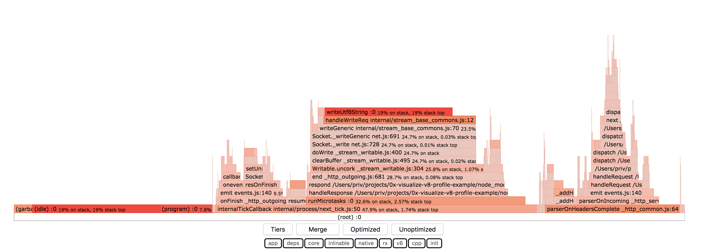

# 0x-visualize-v8-profile-example

You need curl installed. This will probably work on linux and macOS.

Running:

```bash
npm i
./test.sh
```

Then open flamegraph.html, click on `v8` button and you should see something like this:


