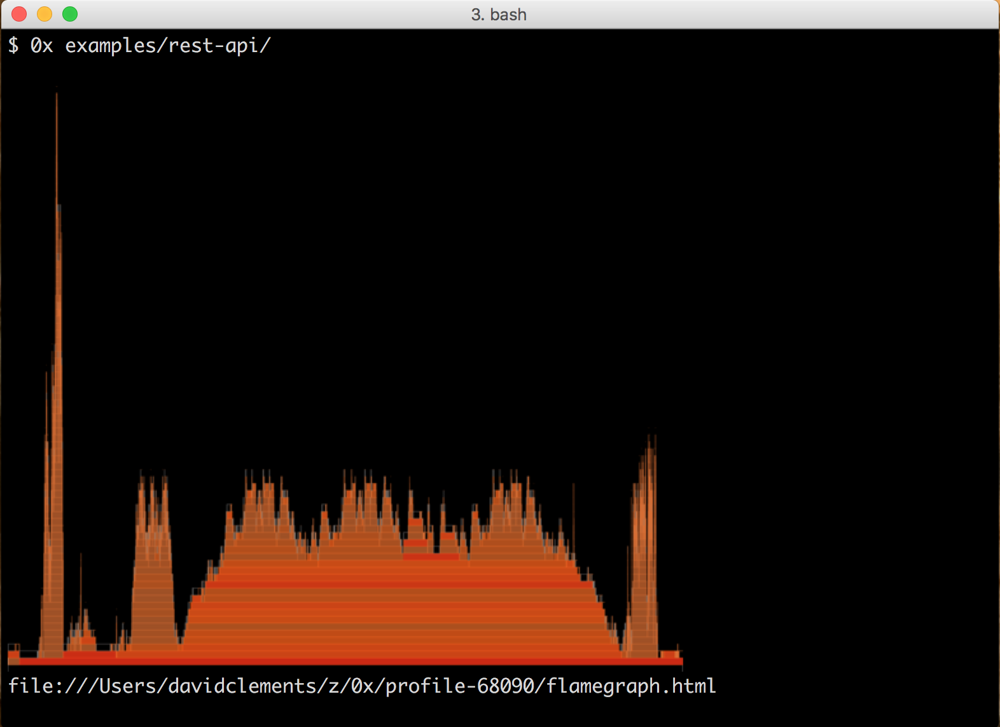

# 0x 

## Visualize Stack Traces

`0x` can profile and generate an interactive flamegraph for a Node process in a single command, on both Linux *and* OS X. Whilst this seems trivial... it's not. Well it wasn't before `0x`.

## Demo


An example interactive flamegraph can be viewed at <http://davidmarkclements.github.io/0x-demo/>

This demo shows a terminal preview, the default behaviour 
is *not* to show a preview, you can use `-p` to turn it on.

## Support

* Linux
* OS X
* SmartOS
* *not* Windows (PR's welcome)

## Install

```sh
npm install -g 0x
```

## Basic Usage

Prefix the usual command for starting a process with 0x:

```sh
0x node my-app.js
``` 

All node args are supported, for instance:

```sh
0x node --trace-opt my-app.js
```

When node flags aren't required, we can use the shorthand form:

```sh
0x my-app.js
```

## Generating 

Once we're ready to generate a flamegraph we send a SIGINT.

The simplest way to do this is pressing CTRL+C.

When `0x` catches the SIGINT, it begins to generate
the stacks and flamegraph output.

If we're using iTerm 2.9 (OS X terminal) or greater, and have imagemagick installed we'll see a gorgeous preview in the terminal.

We'll also have a `file://` URL pointing to the generated `flamegraph.html` file, on OS X we can use cmd+click to open the URL in the default
browser.




## Production Servers

Generating a flamegraph can be quite intense on CPU and memory,
if we have restricted resources we should generate the flamegraph
in two pieces. 

First we can use the `--stacks-only` flag to purely capture stacks.

```sh
0x --stacks-only my-app.js  #0x on the server
```

Press ctrl+c when ready, this will create the usual profile folder,
holding one file, that `stacks.$PID.out` file. 

Now we need to transfer the stacks file from our production server 
to our local dev machine.

Let's say the pid was 7777, we can generate the flamegraph locally with

```sh
0x -c gen stacks.7777.out # 0x locally
```

Now the hard work is done away from production, ensuring we avoid any service-level problems. 

## 0x Flags

### --help | -h

Print usage info

### --preview    

Generates an SVG file, prerenders SVG inside HTML
and outputs a PNG to the terminal (if possible)
Depends on imagemagick (brew install imagemagick)
If using iTerm 2.9+ image will be output to terminal
Warning - depending on the amount of stacks this 
option can take tens of seconds

Default: false

### --langs | -l

Color code the stacks by JS and C

Example: `0x -l my-app.js`

Default: false

### --tiers | -t    

A comma separated list

Overrides langs, Color code frames by type

Examples: `0x -t my-app.js`

Default: false

### --exclude | -x

Exclude tiers or langs, comma seperated list

Options: v8, regexp, nativeC, nativeJS, core, deps, app, js, c

Examples: 
`0x -x v8,nativeC,core my-app.js`
`0x -x c my-app.js`

Default: v8

### --include       

Include tiers, Overwrites exclude. Really only useful
for including the v8 tier (which is excluded by default).

Options: v8, regexp, nativeC, nativeJS, core, deps, app, js, c

Example: `0x --include v8 my-app.js`

Default: false

### --theme         

Dark or Light theme

Options: dark | light

Example: `0x --theme light my-app.js`

Default: dark

### --stacks-only   

Don't generate the flamegraph, only create the stacks 
output. If assigned to '-' stacks output will come through 
stdout. Use this in combination with the `-c gen` argument
to generate the flamegraph from raw stacks.

Options: false | true | -

Examples: 

`0x --stacks-only my-app.js`

`0x --stacks-only=- my-app.js`

Default: false

### --trace-info    

Show output from dtrace or perf tools

Default: false

### --cmd | -c

Run a "0x command", possible commands are `help` and `gen`. 

#### `0x -c help`
outputs advanced usage (i.e. the commands).

#### `0x -c gen` 

The gen command will generate the flamegraph from
a stacks.out file.

Example: `0x -c gen [flags] profile-$PID/stacks.$PID.out > flamegraph.html`

Flags include all the flags that can be passed to 0x

## The Profile Folder

A profile folder will be created and named after the PID, e.g.
`profile-3866`. 

The Profile Folder can contain the following files

* flamegraph-small.png - the preview image output to terminal
* flamegraph.svg - an SVG rendering of the flamegraph
* stacks.3866.out - the traced stacks (run through [perf-sym](http://npmjs.com/perf-sym) on OS X)
* flamegraph.html - the interactive flamegraph
* stacks.3866.json - a JSON tree generated from the stacks, this tree is rendered by d3.js in the flamegraph.html

The is helpful, because there's other things you can do with 
stacks output. For instance, checkout [cpuprofilify](http://npmjs.com/cpuprofilify) and [traceviewify](http://npmjs.com/traceviewify).

## Example

Want to try it out? Clone this repo, run `npm i -g` and 
from the repo root run 

```sh
0x examples/rest-api
```

In another tab run

```sh
npm run stress-rest-example
```

To put some load on the rest server, once that's done
use ctrl + c to kill the server.

Now try some other options, e.g.

```sh
0x -t examples/rest-api
```

## Contributions

Yes please!

## Alternatives

* <https://github.com/brendangregg/FlameGraph> (perl)
* <https://www.npmjs.com/package/stackvis> (node)
* <https://www.npmjs.com/package/d3-flame-graph> (node)

## Acknowledgements

0x is generously sponsored by [nearForm](http://nearform.com)

This tool is essentially a mashup from various info and code
sources, and therefore would have taken much longer without
the following people and their Open Source/Info Sharing efforts

* Thorsten Lorenz (<http://thlorenz.com/>)
* Dave Pacheco (<http://dtrace.org/blogs/dap/about/>)
* Brendan Gregg (<http://www.brendangregg.com/>)
* Martin Spier (<http://martinspier.io/>)

## License

MIT and Apache (depending on the code, see LICENSE.md)

